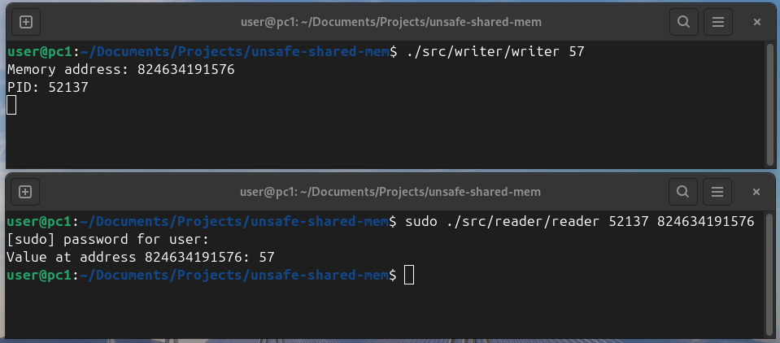

# unsafe-shared-mem



UNSAFE share of memory

```
sudo make build
```

```
./src/writer/writer 57
```
EXAMPE OUTPUT : `Memory address: 824634289880 PID: 51428`

```
./src/reader/reader 51428 824634289880
```
EXAMPLE OUTPUT : `Value at address 824634289880: 57`
